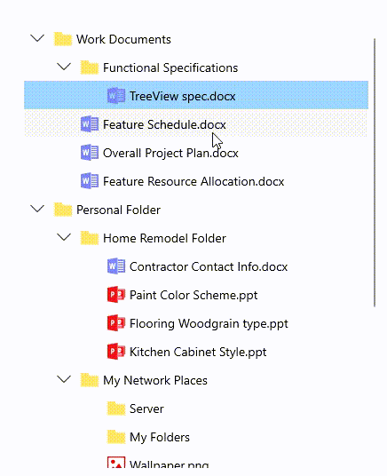
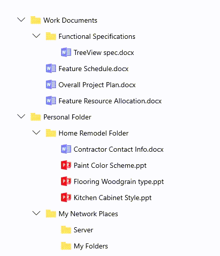

# How to select the items in WinUI TreeView (SfTreeView)?

## About the sample
This example illustrates how to select the items in WinUI TreeView (SfTreeView)?

[WinUI TreeView](https://www.syncfusion.com/winui-controls/treeview) (SfTreeView) allows selecting the items either programmatically or mouse click/touch interactions by setting the [SelectionMode](https://help.syncfusion.com/cr/winui/Syncfusion.UI.Xaml.TreeView.SfTreeView.html#Syncfusion_UI_Xaml_TreeView_SfTreeView_SelectionMode) property value to something other than None. The control has different selection modes to perform selection operations listed as follows.

**None:** Allows disabling the selection.

**Single:** Allows selecting a single item only. When clicking on the selected item, the selection is not cleared. This is the default value for SelectionMode.

**SingleDeselect:** Allows selecting a single item only. When clicking on the selected item, the selection gets cleared.

**Multiple:** Allows selecting more than one item. Selection is not cleared, when selecting multiple items. When clicking on the selected item, the selection gets cleared.

**Extended:** Allows selecting the multiple items using the common key modifiers.

The following code sample explains the single item selection in TreeView.

```XML

<treeView:SfTreeView x:Name="treeView"
                     Width="400"
                     Height="500"
                     AutoExpandMode="AllNodes"
                     ChildPropertyName="Childs"
                     IsAnimationEnabled="True"
                     SelectionMode="Single"
                     FullRowSelect="True"
                     ItemsSource="{Binding Nodes1}">
    <treeView:SfTreeView.ItemTemplate>
        <DataTemplate>
            <StackPanel Orientation="Horizontal">
                <ContentPresenter Width="20"
                                  Height="20"
                                  HorizontalAlignment="Stretch"
                                  VerticalAlignment="Center"
                                  ContentTemplate="{Binding ImageTemplate}" />
                <TextBlock Margin="5"
                           VerticalAlignment="Center"
                           Text="{Binding Header}" />
            </StackPanel>
        </DataTemplate>
    </treeView:SfTreeView.ItemTemplate>
</treeView:SfTreeView>

```


## Multiple Items Selection

TreeView allows to select multiple items by setting the [SfTreeView.SelectionMode](https://help.syncfusion.com/cr/winui/Syncfusion.UI.Xaml.TreeView.SfTreeView.html#Syncfusion_UI_Xaml_TreeView_SfTreeView_SelectionMode) as [Multiple](https://help.syncfusion.com/cr/winui/Syncfusion.UI.Xaml.TreeView.SelectionMode.html#Syncfusion_UI_Xaml_TreeView_SelectionMode_Multiple) or [Extended](https://help.syncfusion.com/cr/winui/Syncfusion.UI.Xaml.TreeView.SelectionMode.html#Syncfusion_UI_Xaml_TreeView_SelectionMode_Extended).

```XML

<treeView:SfTreeView x:Name="treeView"
                     Width="400"
                     Height="500"
                     AutoExpandMode="AllNodes"
                     ChildPropertyName="Childs"
                     IsAnimationEnabled="True"
                     SelectionMode="Multiple"
                     FullRowSelect="True"
                     ItemsSource="{Binding Nodes1}">
    <treeView:SfTreeView.ItemTemplate>
        <DataTemplate>
            <StackPanel Orientation="Horizontal">
                <ContentPresenter Width="20"
                                  Height="20"
                                  HorizontalAlignment="Stretch"
                                  VerticalAlignment="Center"
                                  ContentTemplate="{Binding ImageTemplate}" />
                <TextBlock Margin="5"
                           VerticalAlignment="Center"
                           Text="{Binding Header}" />
            </StackPanel>
         </DataTemplate>
     </treeView:SfTreeView.ItemTemplate>
 </treeView:SfTreeView>
 ```

 
   
## Programmatic Selection
  
When the SelectionMode is other than [None](https://help.syncfusion.com/cr/winui/Syncfusion.UI.Xaml.TreeView.SelectionMode.html#Syncfusion_UI_Xaml_TreeView_SelectionMode_None), the item or items in the TreeView can be selected from the code by setting the [SelectedItem](https://help.syncfusion.com/cr/winui/Syncfusion.UI.Xaml.TreeView.SfTreeView.html#Syncfusion_UI_Xaml_TreeView_SfTreeView_SelectedItem) or adding items to the [SelectedItems](https://help.syncfusion.com/cr/winui/Syncfusion.UI.Xaml.TreeView.SfTreeView.html#Syncfusion_UI_Xaml_TreeView_SfTreeView_SelectedItems) property based on the SelectionMode.

When the selection mode is [Single](https://help.syncfusion.com/cr/winui/Syncfusion.UI.Xaml.TreeView.SelectionMode.html#Syncfusion_UI_Xaml_TreeView_SelectionMode_Single) or [SingleDeselect](https://help.syncfusion.com/cr/winui/Syncfusion.UI.Xaml.TreeView.SelectionMode.html#Syncfusion_UI_Xaml_TreeView_SelectionMode_SingleDeselect), programmatically select an item by setting the underlying object to the `SelectedItem` property.

```C#

treeView.SelectedItem = viewModel.Items[0];

```

When the selection mode is Multiple, programmatically select more than one item by adding the underlying object to the `SelectedItems` property.

```C#

treeView.SelectedItems.Add(viewModel.Items[2]);
treeView.SelectedItems.Add(viewModel.Items[3]);

```

#### Note: If an item is selected programmatically when SelectionMode is None and if multiple items are programmatically selected when SelectionMode is Single or SingleDeselect, then an exception will be thrown internally.

## Events

### SelectionChanging Event

The [SelectionChanging](https://help.syncfusion.com/cr/winui/Syncfusion.UI.Xaml.TreeView.SfTreeView.html#Syncfusion_UI_Xaml_TreeView_SfTreeView_SelectionChanging) event will be triggered while selecting an item at the execution time. The [ItemSelectionChangingEventArgs](https://help.syncfusion.com/cr/winui/Syncfusion.UI.Xaml.TreeView.ItemSelectionChangingEventArgs.html) has the following members, which provide the information for the SelectionChanging event:

* [AddedItems](https://help.syncfusion.com/cr/winui/Syncfusion.UI.Xaml.TreeView.ItemSelectionChangingEventArgs.html#Syncfusion_UI_Xaml_TreeView_ItemSelectionChangingEventArgs_AddedItems): Gets a collection of the underlying data objects where the selection is going to process.

* [RemovedItems](https://help.syncfusion.com/cr/winui/Syncfusion.UI.Xaml.TreeView.ItemSelectionChangingEventArgs.html#Syncfusion_UI_Xaml_TreeView_ItemSelectionChangingEventArgs_RemovedItems): Gets a collection of the underlying data objects where the selection is going to remove.

```C#

treeView.SelectionChanging += OnSelectionChanging;
 
private void OnSelectionChanging(object sender, ItemSelectionChangingEventArgs e)
{
}

```    

### SelectionChanged event

The [SelectionChanged](https://help.syncfusion.com/cr/winui/Syncfusion.UI.Xaml.TreeView.SfTreeView.html#Syncfusion_UI_Xaml_TreeView_SfTreeView_SelectionChanged) event will occur, once the selection process has been completed for the selected item in the TreeView. The [ItemSelectionChangedEventArgs](https://help.syncfusion.com/cr/winui/Syncfusion.UI.Xaml.TreeView.ItemSelectionChangedEventArgs.html) has the following members, which provide information for the SelectionChanged event:

  * [AddedItems](https://help.syncfusion.com/cr/winui/Syncfusion.UI.Xaml.TreeView.ItemSelectionChangedEventArgs.html#Syncfusion_UI_Xaml_TreeView_ItemSelectionChangedEventArgs_AddedItems): Gets a collection of the underlying data objects where the selection has been processed.

  * [RemovedItems](https://help.syncfusion.com/cr/winui/Syncfusion.UI.Xaml.TreeView.ItemSelectionChangedEventArgs.html#Syncfusion_UI_Xaml_TreeView_ItemSelectionChangedEventArgs_RemovedItems): Gets a collection of the underlying data objects where the selection has been removed.

```C#

treeView.SelectionChanged += OnSelectionChanged;
 
private void OnSelectionChanged(object sender, ItemSelectionChangedEventArgs e)
{
}

```  
  
#### Note: SelectionChanging and SelectionChanged events will be triggered only on UI interactions.

## Disable the selection for a specific item

TreeView selection for specific items can be disabled by setting the **ItemSelectionChangingEventArgs.Cancel** property to true in the SelectionChanging event.

```C#

treeView.SelectionChanging += OnSelectionChanging;
 
private void OnSelectionChanging(object sender, ItemSelectionChangingEventArgs e)
{
    if(e.AddedItems.Count > 0)
    {
       //disable the selection for specific items by setting the ItemSelectionChangingEventArgs.Cancel property to true.
       if ((e.AddedItems[0] as Model).Header == "Overall Project Plan.docx" || (e.AddedItems[0] as Model).Header == "Server")
         e.Cancel = true;
    }
}

```  
Take a moment to peruse the [WinUI TreeView - Selection](https://help.syncfusion.com/winui/treeview/selection) documentation, where you can find about selection with code examples.
